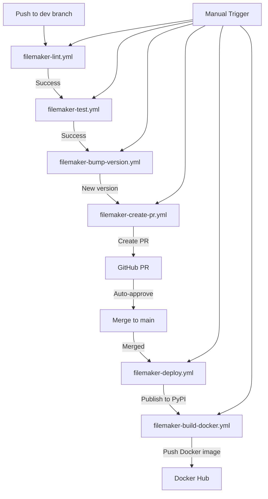

# GitHub Actions Workflows for FileMaker Provider

This directory contains GitHub Actions workflows to automate the CI/CD pipeline for the FileMaker provider package.

## Workflow Diagram

## Workflows

### Publish to PyPI (`publish-to-pypi.yml`)

This workflow handles the process of publishing the package to PyPI. It includes:

1. **Quality Check**: Linting the code with flake8 and pylint
2. **Testing**: Running tests against multiple Python versions
3. **Building**: Creating the package distribution files
4. **Publishing**: Uploading the package to PyPI

## How to Use

### Publishing to PyPI

This workflow is triggered in two ways:

1. **Automatically** when a new release is created in GitHub
2. **Manually** through the GitHub Actions interface

#### Setting up PyPI Credentials

Before using this workflow, you need to set up your PyPI API token:

1. Generate an API token on PyPI (https://pypi.org/manage/account/token/)
2. Add the token as a secret in your GitHub repository:
   - Go to your repository settings
   - Navigate to "Secrets" and then "Actions"
   - Create a new secret named `PYPI_API_TOKEN` with your token as the value

#### Creating a GitHub Release

To trigger the workflow via a release:

1. Go to the "Releases" section of your repository
2. Click "Draft a new release"
3. Create a new tag (e.g., v0.1.0)
4. Add a title and description
5. Click "Publish release"

The workflow will automatically start and publish the package to PyPI.

#### Manual Triggering

To trigger the workflow manually:

1. Go to the "Actions" tab in your repository
2. Select the "Publish Python Package to PyPI" workflow
3. Click "Run workflow"
4. Select the branch to run from
5. Click "Run workflow"

## Troubleshooting

If the workflow fails, check the logs for error messages. Common issues include:

- Failed tests
- Linting errors
- Invalid package structure
- PyPI token issues

If you encounter problems with PyPI publishing, ensure your token has the correct permissions and hasn't expired.